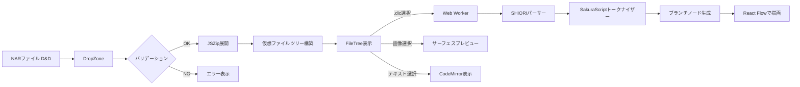

# ARCHITECTURE.md

## 1. System Overview

**ghost-viewer** は、伺か（ukagaka）ゴーストの NAR ファイルをブラウザ上で展開・可視化し、会話パターンをツリー構造として分析するための SPA ツールである。

SHIORI 言語（YAYA / Satori / Kawari）で記述された会話スクリプトの構造を俯瞰的に把握し、分岐・遷移のパターンを視覚的に分析できる環境を提供する。

---

## 2. Tech Stack

### 言語 / フレームワーク / ランタイム

| 技術 | バージョン | 用途 |
|------|-----------|------|
| TypeScript | 5.x | 型安全な開発 |
| React | 19.x | UIコンポーネント |
| Node.js | 20.x | ビルド・開発環境 |

### 主要ライブラリ

| ライブラリ | 選定理由 |
|-----------|---------|
| JSZip | クライアントサイドでの NAR（ZIP）展開。サーバー不要のブラウザ完結処理 |
| React Flow | 会話ブランチのノードグラフ描画。ズーム・パン・ノード操作が組み込み済み |
| CodeMirror 6 | .dic ファイルのシンタックスハイライト表示。拡張性が高くカスタム言語定義が可能 |
| Tailwind CSS 4.x | ユーティリティファーストのスタイリング。コンポーネントごとのスコープ管理が不要 |
| Zustand | 軽量な状態管理。Web Worker 間の状態共有にも対応しやすい |

### ビルドツール

| ツール | 用途 |
|--------|------|
| Vite 6.x | ビルド・バンドル・HMR |

### テストフレームワーク

| ツール | 用途 |
|--------|------|
| Vitest | ユニットテスト・統合テスト。Vite ネイティブで設定不要 |

### リンター / フォーマッター

| ツール | 用途 |
|--------|------|
| Biome | リント・フォーマットを1ツールで完結。高速 |

---

## 3. Directory Structure

```
ghost-viewer/
├── public/                    # 静的アセット（404.html等）
├── src/
│   ├── components/            # React UIコンポーネント
│   │   ├── file-tree/         # ファイルツリービュー（F2）
│   │   ├── script-viewer/     # スクリプトビューアー（F3）
│   │   ├── branch-viewer/     # 会話ブランチビューアー（F4）
│   │   ├── dashboard/         # メタ情報ダッシュボード（F5）
│   │   └── common/            # 共通UIコンポーネント（レイアウト、スプリッター等）
│   ├── lib/                   # ビジネスロジック（React非依存）
│   │   ├── nar/               # NAR展開・バリデーション
│   │   ├── parsers/           # SHIORI言語別パーサー（YAYA / Satori / Kawari）
│   │   ├── sakura-script/     # SakuraScriptトークナイザー
│   │   └── analyzers/         # 統計・分析ロジック
│   ├── workers/               # Web Worker定義
│   ├── stores/                # Zustandストア定義
│   ├── types/                 # 共有型定義
│   ├── App.tsx                # ルートコンポーネント
│   └── main.tsx               # エントリーポイント
├── tests/                     # テストファイル
├── .github/
│   └── workflows/             # GitHub Actions（deploy.yml）
├── biome.json                 # Biome設定
├── vite.config.ts             # Vite設定
├── tsconfig.json              # TypeScript設定
└── package.json
```

---

## 4. Data Flow

### 主要フロー：NARファイルの読み込みから可視化まで

```
ユーザー操作                UI層                        ロジック層                   データストア
─────────────────────────────────────────────────────────────────────────────────────────────
NARファイルを              DropZone                    nar/validator               Zustand
ドラッグ&ドロップ    →     コンポーネント         →    (サイズ/パス検証)      →    fileTreeStore
                           が File を受け取る          nar/extractor                (仮想ファイルツリー)
                                                       (JSZipで展開)

ファイルツリーで            FileTree                    ─                           fileTreeStore
.dicファイルを選択   →     コンポーネント         →                           →    selectedFileStore
                           がクリックイベント発火

選択された.dicの            ─                           [Web Worker]                parsedDataStore
解析が開始           →                            →    parsers/yaya|satori   →    (パース結果)
                                                       sakura-script/tokenizer

ブランチビューアーに        BranchViewer                parsedDataStore             ─
ノードグラフ表示     ←     (React Flow)           ←    からノード/エッジ生成  ←
```

### Mermaid図



---

## 5. Key Interfaces / Boundaries

### モジュール間の境界

```
┌─────────────────────────────────────────────────────────┐
│ UI層（src/components/）                                  │
│  - React コンポーネント                                   │
│  - ユーザーインタラクションの受け付け                        │
│  - Zustand ストアの購読・更新                              │
├─────────────────────────────────────────────────────────┤
│ ストア層（src/stores/）                                   │
│  - fileTreeStore: 展開済みファイルツリー、選択状態           │
│  - parseStore: パース結果（トークン・ノード・エッジ）         │
│  - ghostStore: ゴーストメタ情報、SHIORI種別、統計           │
├─────────────────────────────────────────────────────────┤
│ ロジック層（src/lib/）                                    │
│  - React非依存の純粋なデータ処理                            │
│  - Web Worker 経由でメインスレッドから分離                   │
├─────────────────────────────────────────────────────────┤
│ Worker層（src/workers/）                                  │
│  - メインスレッド ↔ Worker 間は postMessage で通信          │
│  - 入力: ファイルバイナリ（ArrayBuffer）                    │
│  - 出力: 構造化されたパース結果（JSON シリアライズ可能）      │
└─────────────────────────────────────────────────────────┘
```

### Worker 通信インターフェース

```typescript
// メインスレッド → Worker
type WorkerRequest =
  | { type: "parse"; fileContent: ArrayBuffer; fileName: string; shioriType: ShioriType }

// Worker → メインスレッド
type WorkerResponse =
  | { type: "parsed"; result: ParseResult }
  | { type: "error"; message: string }
  | { type: "progress"; percent: number }
```

### 外部APIとの接点

外部APIへの通信は行わない。すべての処理はクライアントサイドで完結する。

- **入力**: ユーザーがローカルから提供する NAR/ZIP ファイル
- **出力**: ブラウザ上での可視化のみ（サーバーへの送信なし）

---

## 6. Design Decisions

### ADR-001: ツリー描画に React Flow を採用

- **決定**: 会話ブランチの描画に React Flow を使用する
- **理由**: ノードのズーム・パン・ドラッグが標準機能として提供される。React コンポーネントをノードとして直接使用でき、カスタムノード（ダイアログプレビュー、サーフェスサムネイル等）の実装が容易
- **検討した代替案**: D3.js — より低レベルな制御が可能だが、インタラクション実装の工数が大きい
- **トレードオフ**: React Flow はノード数が多い場合にパフォーマンスが低下する可能性がある。遅延レンダリングで対処する

### ADR-002: 解析処理を Web Worker で分離

- **決定**: SHIORI パースと SakuraScript トークナイズを Web Worker で実行する
- **理由**: 大規模な .dic ファイル（数千行）の解析でメインスレッドがブロックされると UI がフリーズする。Worker 分離によりレスポンシブな操作を維持する
- **検討した代替案**: メインスレッドでの非同期チャンク処理 — 実装が単純だが、CPU バウンドな処理では効果が限定的
- **トレードオフ**: Worker との通信はシリアライズが必要。構造化クローンのコストが発生する

### ADR-003: 状態管理に Zustand を採用

- **決定**: グローバル状態の管理に Zustand を使用する
- **理由**: 軽量で API がシンプル。React コンポーネント外（Worker 通信のコールバック等）からもストアを操作できる。ボイラープレートが少ない
- **検討した代替案**: Jotai — アトミックな状態管理で再レンダリング制御に優れるが、ストア間の依存関係が複雑になりやすい。React Context — 外部依存なしだが、再レンダリングの最適化に手動対応が必要
- **トレードオフ**: 大規模なストア分割のパターンが React Context ほど明確ではない

### ADR-004: SPA のデプロイ先に GitHub Pages を採用

- **決定**: GitHub Pages に Vite のビルド成果物を GitHub Actions でデプロイする
- **理由**: サーバーレスで運用コストゼロ。GitHub リポジトリと一元管理できる
- **検討した代替案**: Cloudflare Pages — より高機能だが、このプロジェクトではサーバーサイド機能が不要
- **トレードオフ**: SPA ルーティングに 404.html リダイレクトのワークアラウンドが必要

### ADR-005: リンター/フォーマッターに Biome を採用

- **決定**: ESLint + Prettier の代わりに Biome を使用する
- **理由**: 1ツールでリント・フォーマットが完結し、設定がシンプル。Rust 製で高速
- **検討した代替案**: ESLint + Prettier — エコシステムが広いが、2ツールの設定・競合管理が煩雑
- **トレードオフ**: Biome のルールカバレッジは ESLint プラグインエコシステムより狭い。このプロジェクトの規模では十分

---

## 7. Constraints & Non-Goals

### Non-Goals（やらないこと）

- NAR ファイルの編集・書き出し機能（読み取り専用ビューアー）
- サーバーサイド処理（すべてクライアントサイドで完結）
- SHIORI エンジンの実行・シミュレーション（静的解析のみ）
- ゴースト間通信（COMMUNICATE）のシミュレーション
- NAR ファイルのオンラインリポジトリとの連携・ダウンロード機能
- 複数ブラウザタブ間のデータ共有
- モバイル端末への最適化

### 制約

| 項目 | 制約 |
|------|------|
| NAR ファイルサイズ上限 | 100MB（File.size でチェック） |
| 展開後サイズ上限 | 200MB |
| エントリ数上限 | 5,000 件 |
| 解析タイムアウト | 30 秒 |
| 対応ブラウザ | Chrome / Firefox / Edge（最新2バージョン）。Safari は未検証 |
| 文字エンコーディング | Shift_JIS / EUC-JP / UTF-8 を自動判別（TextDecoder） |
| デプロイ先 | GitHub Pages（静的ホスティング） |
